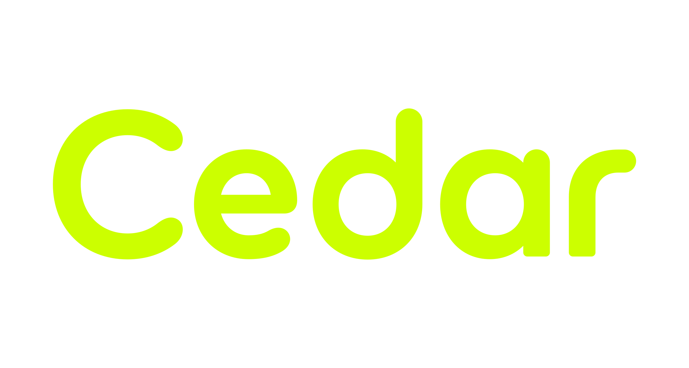

# Cedar-Stack

Cedar-Stack is a new and early-stage C++ framework currently under active development. It is designed to offer a comprehensive and modular solution for modern industrial-grade software development, balancing ease of use and performance to accommodate varying development needs.

## Cedar-Core Module
Cedar-Core is the core component of the Cedar-Stack framework, encompassing the following key features:

Math: Provides basic and advanced mathematical computation capabilities.
IO: Simplifies file and network I/O operations.
Network: Supports the implementation of network communications.
String: Enhanced string operations, supporting a wide range of character sets.
Threading: Provides multi-threading capabilities to optimize performance and resource management.
Serialization: Supports data serialization and deserialization, including but not limited to JSON and XML formats.

### Current Progress and Goals
Development of Cedar-Core is proceeding according to the following plan:

- [X] Initialize project structure
- [] Complete the basic math library
- [x] Implement efficient string processing modules
- [] Develop file and network I/O functionalities
- [] Enhance network communication support
- [] Implement multi-threading features
- [] Develop data serialization modules

## 💻 Prerequisites
Before you begin using or contributing to Cedar-Core, please ensure your system meets the following requirements:

Operating System: Linux
Build System: CMake

## 🚀 Installation Guide
Cedar-Core is currently in the development stage and does not yet offer a formal installation process. Detailed installation steps will be provided as development progresses.

## ☕ Usage Notes
Please note that Cedar-Core is still in the early stages of development and is recommended for use only in development and testing environments to avoid potential stability issues.

## 📫 How to Contribute
If you are interested in contributing to the development of Cedar-Core, please follow these steps:

Fork the repository
Create your feature branch (git checkout -b feature/AmazingFeature)
Commit your changes (git commit -m 'Add some AmazingFeature')
Push to the branch (git push origin feature/AmazingFeature)
Open a Pull Request

## 🤝 Contributors
Thank you to all the developers who have contributed to Cedar-Stack:

<table>
  <tr>
    <td align="center">
      <a href="#" title="Profile link">
         
        
          <b>HH45137</b>
        
      </a>
    </td>
    <td align="center">
      <a href="#" title="Profile link">
         
        
          <b>itshusky01</b>
        
      </a>
    </td>
  </tr>
</table>

## 📝 License
Refer to the LICENSE file for detailed information about the project's license.
